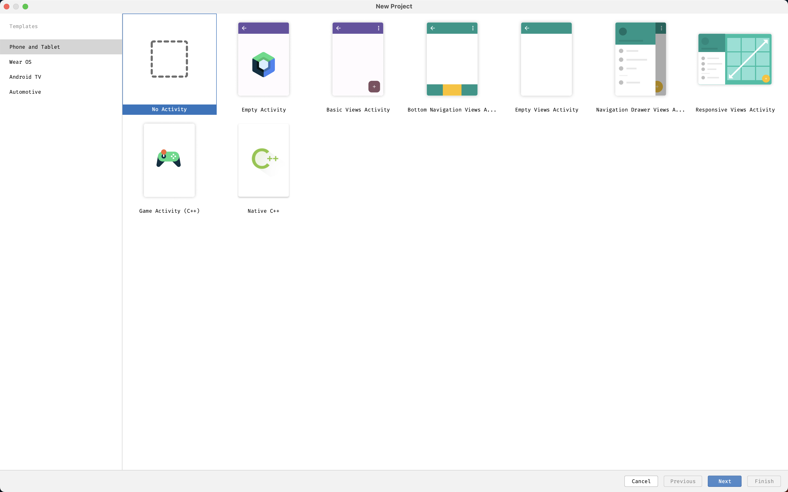
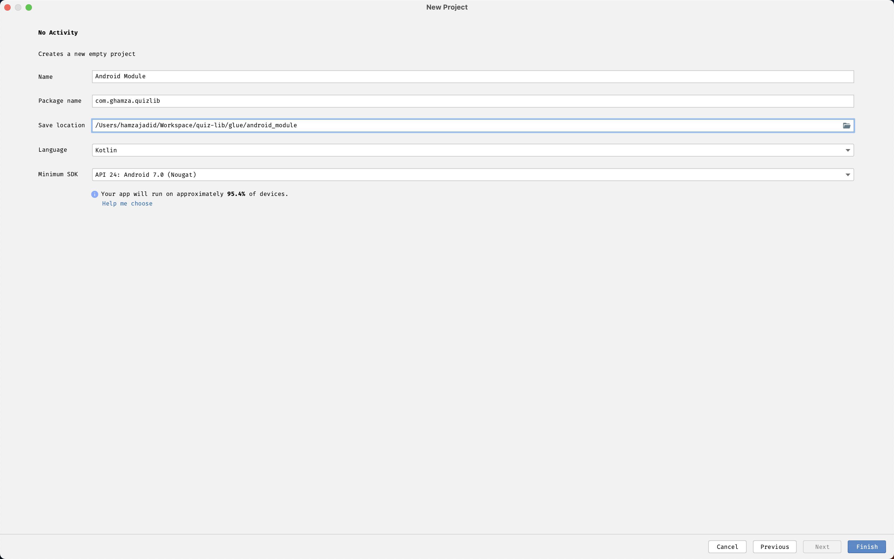

# Android Setup

Well, sadly creating an android library isn't as simple as using a bash command with some arguments.

> It would've been awesome (maybe?) to have a tool called `actl` - Android Command-Line Tool
>
> `aclt create --template=android-library --path=glue/android_module`, I can dream.

So here we go, screenshot spam time.

## Project Setup

Create a new folder called `glue`, which will contain platform specifics glue.

```bash
mkdir glue
```

## Create a New Android Project

Create an new project and pick `No Activity`.



Name the project and save it inside `glue/android_module`



## Cleaning Up

We created a new android app, we want to create a library, so let us start by delete the app.

### 1. Remove the include app

```diff file=glue/android_module/settings.gradle
pluginManagement {
    repositories {
        google()
        mavenCentral()
        gradlePluginPortal()
    }
}
dependencyResolutionManagement {
    repositoriesMode.set(RepositoriesMode.FAIL_ON_PROJECT_REPOS)
    repositories {
        google()
        mavenCentral()
    }
}
rootProject.name = "Android Module"
-include ':app'
```

### 2. Delete the app directory

```plantuml,format=svg
@startsalt
{
    {T
        + quiz-library
            ++ .gitignore
            ++ Cargo.toml
            ++ quiz_core
                +++ ...
            ++ glue
                +++ android_module
                    ++++ <color:red> app
                        +++++ <color:red> libs
                        +++++ <color:red> src
                        +++++ <color:red> ...
    }
}
@endsalt
```



### 3. Remove the application plugin

```diff file=glue/android_module/build.gradle
// Top-level build file where you can add configuration options common to all sub-projects/modules.
plugins {
-    id 'com.android.application' version '8.0.1' apply false
    id 'com.android.library' version '8.0.1' apply false
    id 'org.jetbrains.kotlin.android' version '1.8.20' apply false
}
```

## Create Android Library
