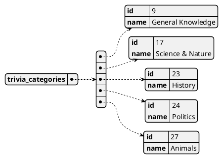

# Library Core Logic

In this section, we will add the logic for our library and try running it in the Rust client crate.

## API

We will use the [Open Trivia DB](https://opentdb.com/) APIs.

## Fetching Categories - Blocking

Fetching the categories is the easiest one between those APIs, a get request that requires no query params or anything.

First, let us test it on our terminal.

```bash
curl 'https://opentdb.com/api_category.php'
```

Now let us send the same request from Rust, we're going to start by sending a blocking request, so our program won't continue
executing until we receive something, the result, or the error.

I like to make libraries support both async and blocking requests to give the library users the option to either throw
the concurrency to the library or manage it from the platform side, like using coroutines in Kotlin,
dispatch queue in Swift, or promises in Javascript.

To send a request, we need to add the `reqwest` crate in `quiz_core`.

```bash
cargo add -p quiz_core reqwest --features blocking json
```

> _**📄 Note:** We've added the `json` feature to parse the response as JSON. And we've added the blocking feature to use
> them to have the option of sending blocking requests._

Create a file named `blocking.rs` inside the core library and declare it as a public module in `lib.rs`.

```plantuml,format=svg
@startsalt
{
    {T
        + quiz-library
            ++ Cargo.toml
            ++ apps
                +++ rust_client
                    ++++ Cargo.toml
                    ++++ src
                        +++++ main.rs
            ++ quiz_core
                +++ Cargo.toml
                +++ src
                    ++++ <color:limegreen>blocking.rs
                    ++++ lib.rs
    }
}
@endsalt
```



```rust file=quiz_core/src/lib.rs
pub mod blocking;
```

Now lets add fetch categories request

```rust file=quiz_core/src/blocking.rs
use reqwest::blocking::Client;

pub fn fetch_categories_blocking() {
    let client = Client::new();
    let res = client
        .get("https://opentdb.com/api_category.php")
        .send()
        .unwrap()
        .text()
        .unwrap();

    println!("{:?}", res);
}
```

We will unwrap the result and worry about error handling later.

The final piece is to use this function in our rust client crate.

```rust file=apps/rust_client/src/main.rs
use quiz_core::blocking::fetch_categories_blocking;

fn main() {
    fetch_categories_blocking();
}
```

Run the app.

```bash
cargo run --bin rust_client
```

You should see the same response when we ran the curl command, but uglier.

If we look closely at the output from our code and the curl command, we will notice that the output has a structure:



So our response contains a field named `trivia_categories`, which has an array of objects (in our case, a structure).
Each object has an `id` and a `name`.

Create a file `dto.rs`. This will store our DTOs (data transfer objects). Add it as a public module to `lib.rs`.

```plantuml,format=svg
@startsalt
{
    {T
        + quiz-library
            ++ Cargo.toml
            ++ apps
                +++ rust_client
                    ++++ Cargo.toml
                    ++++ src
                        +++++ main.rs
            ++ quiz_core
                +++ Cargo.toml
                +++ src
                    ++++ blocking.rs
                    ++++ <color:limegreen>dto.rs
                    ++++ lib.rs
    }
}
@endsalt
```



```rust hl=[2] file=quiz_core/src/lib.rs
pub mod blocking;
pub mod dto;
```

```rust file=quiz_core/src/dto.rs
struct CategoryResponse {
    trivia_categories: Vec<Category>,
}

struct Category {
    id: u32,
    name: String,
}
```

Now to convert the response from a JSON string to our structure, we need to use a crate called serde and serde_json.

```bash
cargo add -p quiz_core serde_json serde --features serde/derive
```

Serde is a framework for efficiently and generically serializing Rust data structures.

Serializing converts a data structure to another representation that can be stored in a file and
transmitted over the network. Deserializing is the opposite action.

Other crates use `serde` to serialize and deserialize to a specific representation. We're using `serde_json` to
convert to and from JSON.

Here we also add the `derive` feature for `serde`. The `derive` feature gives us the ability to declare a structure
to be serializable or deserializable, or both by using the derive macro.

Let us declare the same structure and add `Deserialize` and `Debug` so that we can print the structure in an appealing way.

```rust hl=[1,3,9] file=quiz_core/src/dto.rs
use serde::Deserialize;

#[derive(Deserialize, Debug)]
struct Category {
    id: u32,
    name: String,
}

#[derive(Deserialize, Debug)]
struct CategoryResponse {
    trivia_categories: Vec<Category>,
}
```

Now we can deserialize the request from JSON to our data structure.

```rust hl=[2,10,13] file=quiz_core/src/blocking.rs
 use reqwest::blocking::Client;
 use crate::dto::CategoryResponse;

 pub fn fetch_categories_blocking() {
     let client = Client::new();
     let res = client
         .get("https://opentdb.com/api_category.php")
         .send()
         .unwrap()
         .json::<CategoryResponse>()
         .unwrap();

     println!("{:#?}", res);
 }
```

And finally, run the rust client.

```bash
cargo run --bin rust_client
```

Our output should be prettier now.

```text
CategoryResponse {
    trivia_categories: [
        Category {
            id: 9,
            name: "General Knowledge",
        },
        Category {
            id: 10,
            name: "Entertainment: Books",
        },
...
```

## Fetching Categories - Async

Now let's implement the async version of the same request.

Create a file named `asynchronous.rs` inside the core library and declare it as a public module in `lib.rs`.

```plantuml,format=svg
@startsalt
{
    {T
        + quiz-library
            ++ Cargo.toml
            ++ apps
                +++ rust_client
                    ++++ Cargo.toml
                    ++++ src
                        +++++ main.rs
            ++ quiz_core
                +++ Cargo.toml
                +++ src
                    ++++ <color:limegreen>asynchronous.rs
                    ++++ blocking.rs
                    ++++ dto.rs
                    ++++ lib.rs
    }
}
@endsalt
```



```rust hl=[1] file=quiz_core/src/lib.rs
pub mod asynchronous;
pub mod blocking;
pub mod dto;
```

Now lets add fetch categories request

```rust file=quiz_core/src/asynchronous.rs
use crate::dto::CategoryResponse;
use reqwest::Client;

pub async fn fetch_categories_async() {
    let client = Client::new();
    let res = client
        .get("https://opentdb.com/api_category.php")
        .send()
        .await
        .unwrap()
        .json::<CategoryResponse>()
        .await
        .unwrap();

    println!("{:#?}", res);
}
```

> _**📄 Note:** The .await instead of await keyword is a game changer in syntax verbosity. For example, the
> same code in JS or Swift will require us to have parenthesis if we want to have it on a single line._
>
> Example: `await (await client.get()).json()` so with every `await` you'll be one step closer to being LISP.

Now before adding it to the client, we need an async runtime.

Async in Rust is pretty interesting. When marking a function or a block as `async` we leave the concurrency to be handled
by the runtime implementor. Runtime implementers can then use threads to handle concurrency or event loops if, for example,
we're targeting a system with limited resources like embedded systems.

We will use tokio's runtime for our client app.

Install it with:

```bash
cargo add tokio --features rt macros rt-multi-thread
```

And finally, modify the client crate to use the async version.

```rust hl=[1,3,7-10] file=apps/rust_client/src/main.rs
use quiz_core::asynchronous::fetch_categories_async;
use quiz_core::blocking::fetch_categories_blocking;
use tokio::runtime::Runtime;

fn main() {
    fetch_categories_blocking();
    let rt = Runtime::new().unwrap();
    rt.block_on(async {
        fetch_categories_async().await;
    });
}
```

## Fetching Questions

Fetching questions requires a little bit more effort since we need to pass query params.

But first let us try and send a curl request,

```bash
curl 'https://opentdb.com/api.php?amount=1'
```

Now we want to create another stucture for the request. It will only contain the `amount` field.

```rust hl=[6-14] file=quiz_core/src/dto.rs
#[derive(Deserialize, Debug)]
pub struct CategoryResponse {
    trivia_categories: Vec<Category>,
}

#[derive(Serialize, Debug)]
pub struct QuestionRequest {
    amount: u32,
}

impl QuestionRequest {
    pub fn new(amount: u32) -> Self {
        Self { amount }
    }
}
```

We've made `QuestionRequest` serializable so we can convert it to a query string.

> _**📄 Note:** As you can see we use `serde` for JSON and query string serialization. This is the power of `serde`,
> being generic in seralization and deserialization and not being tied to a specific format._

Then, we can add the get requests for the questions.

```rust hl=[1,16,27] file=quiz_core/src/blocking.rs
use crate::dto::{CategoryResponse, QuestionRequest};
use reqwest::blocking::Client;

pub fn fetch_categories_blocking() {
    let client = Client::new();
    let res = client
        .get("https://opentdb.com/api_category.php")
        .send()
        .unwrap()
        .json::<CategoryResponse>()
        .unwrap();

    println!("{:#?}", res);
}

pub fn fetch_questions_blocking(query_params: QuestionRequest) {
    let client = Client::new();
    let res = client
        .get("https://opentdb.com/api.php")
        .query(&query_params)
        .send()
        .unwrap()
        .text()
        .unwrap();

    println!("{:#?}", res);
}
```

```rust hl=[1,18-31] file=quiz_core/src/asynchronous.rs
use crate::dto::{CategoryResponse, QuestionRequest};
use reqwest::Client;

pub async fn fetch_categories_async() {
    let client = Client::new();
    let res = client
        .get("https://opentdb.com/api_category.php")
        .send()
        .await
        .unwrap()
        .json::<CategoryResponse>()
        .await
        .unwrap();

    println!("{:#?}", res);
}

pub async fn fetch_questions_async(query_params: QuestionRequest) {
    let client = Client::new();
    let res = client
        .get("https://opentdb.com/api.php")
        .query(&query_params)
        .send()
        .await
        .unwrap()
        .text()
        .await
        .unwrap();

    println!("{:#?}", res);
}
```

Finally, we can use these functions inside our client crate:

```rust hl=[1-3,8,12] file=apps/rust_client/src/main.rs
use quiz_core::asynchronous::{fetch_categories_async, fetch_questions_async};
use quiz_core::blocking::{fetch_categories_blocking, fetch_questions_blocking};
use quiz_core::dto::QuestionRequest;
use tokio::runtime::Runtime;

fn main() {
    fetch_categories_blocking();
    fetch_questions_blocking(QuestionRequest::new(10));
    let rt = Runtime::new().unwrap();
    rt.block_on(async {
        fetch_categories_async().await;
        fetch_questions_async(QuestionRequest::new(10)).await;
    });
}
```
