# Setting up the Core

## Cargo Workspace

We will create a new rust project and make it a workspace to cross-reference multiple crates inside our project.

```bash
cargo new quiz-library
```

Change the directory to `quiz-library` and delete the `src` folder.

Finally, replace the content of `Cargo.toml` with our workspace configuration.

```toml
[workspace]
members = []
```

## Core Crate

We are going to add crates to our workspace as we go. The first crate is going
to be our core crate.

```bash
cargo new quiz_core --lib --vcs none
```

> We do not need a version control system on the new crates
> since it already created one when we ran `cargo new quiz-library`.

Then add `quiz_core` to the root `Cargo.toml`.

```toml [hl,3]
[workspace]
members = [
    "quiz_core"
]
```

The result of this part should have this folder structure:

```plantuml,format=svg
@startsalt
{
    {T
        + quiz-library
            ++ .gitignore
            ++ Cargo.lock
            ++ Cargo.toml
            ++ <color:limegreen>quiz_core
                +++ <color:limegreen>Cargo.toml
                +++ <color:limegreen>src
                    ++++ <color:limegreen>lib.rs
            ++ <color:darkgrey>target/
    }
}
@endsalt
```



> `Cargo.lock` and `target` might be missing if the project wasn't built yet.

## Rust Client Crate

I like to separate the client from the library by using different crates. It is a small amount of work yet it makes our
project future-proof. For example, adding a GUI dependency for our client.

We will do the same as we did for the core crate. Create another crate and add it to the workspace.

```bash
cargo new apps/rust_client --bin --vcs none
```

```toml [hl,4]
[workspace]
members = [
    "quiz_core",
    "apps/rust_client"
]
```

Now we can test it by running:

```bash
cargo run --bin rust_client
# Hello, world!
```

Sturcture:

```plantuml,format=svg
@startsalt
{
    {T
        + quiz-library
            ++ .gitignore
            ++ Cargo.lock
            ++ Cargo.toml
            ++ <color:limegreen>apps
                +++ <color:limegreen>rust_client
                    ++++ <color:limegreen>Cargo.toml
                    ++++ <color:limegreen>src
                        +++++ <color:limegreen>main.rs
            ++ quiz_core
                +++ Cargo.toml
                +++ src
                    ++++ lib.rs
            ++ <color:darkgrey>target/
    }
}
@endsalt
```



We put the rust client inside an app folder because we will introduce other applications. For iOS, android, and web.

Finally, we need to add and use the library inside the rust client crate we created.

```bash
cargo add -p rust_client --path quiz_core/
```

```rust
// apps/rust_client/src/main.rs
use quiz_core::add;

fn main() {
    println!("2 + 2 = {}", add(2, 2));
}
```

Run again.

```bash
cargo run --bin rust_client
# 2 + 2 = 4
```

The setup is done! Now we can focus on writing the actual library.
