# Setting up the Core

## Cargo Workspace

We will create a new rust project and make it a workspace to cross-reference multiple crates inside our project.

```bash
cargo new quiz-library
```



```plantuml,format=svg
@startsalt
{
    {T
        + quiz-library
            ++ .gitignore
            ++ <color:limegreen>src
                +++ <color:limegreen>main.rs
            ++ Cargo.toml
    }
}
@endsalt
```

Delete the `src` folder.

```plantuml,format=svg
@startsalt
{
    {T
        + quiz-library
            ++ .gitignore
            ++ <color:red>src
                +++ <color:red>main.rs
            ++ Cargo.toml
    }
}
@endsalt
```



Then replace the content of `Cargo.toml` with our workspace configuration.

```toml file=Cargo.toml
[workspace]
members = []
```

## Core Crate

We are going to add crates to our workspace as we go. The first crate is going
to be our core crate.

```bash
cargo new quiz_core --lib --vcs none
```

> _**📄 Note:** We do not need a version control system (vcs) on the new crates since it already initialized one when we
> ran `cargo new quiz-library`._

```plantuml,format=svg
@startsalt
{
    {T
        + quiz-library
            ++ Cargo.toml
            ++ <color:limegreen>quiz_core
                +++ <color:limegreen>Cargo.toml
                +++ <color:limegreen>src
                    ++++ <color:limegreen>lib.rs
    }
}
@endsalt
```



Then add `quiz_core` as a workspace member to the root `Cargo.toml`.

```toml hl=[3] file=Cargo.toml
[workspace]
members = [
    "quiz_core"
]
```

## Rust Client Crate

I like to separate the client from the library by using different crates. It is a small amount of work yet it makes our
project future-proof. For example, adding GUI, it a client dependency and should not be included in our library.

We will do the same as we did for the core crate. Create another crate and add it to the workspace.

```bash
cargo new apps/rust_client --bin --vcs none
```



```plantuml,format=svg
@startsalt
{
    {T
        + quiz-library
            ++ Cargo.toml
            ++ <color:limegreen>apps
                +++ <color:limegreen>rust_client
                    ++++ <color:limegreen>Cargo.toml
                    ++++ <color:limegreen>src
                        +++++ <color:limegreen>main.rs
            ++ quiz_core
                +++ Cargo.toml
                +++ src
                    ++++ lib.rs
    }
}
@endsalt
```

```toml hl=[4] file=Cargo.toml
[workspace]
members = [
    "quiz_core",
    "apps/rust_client"
]
```

Now we can test it by running:

```bash
cargo run --bin rust_client
# Hello, world!
```

We put the rust client inside an app folder because we will introduce other applications. For iOS, android, and web.

Finally, we need to add and use the library inside the rust client crate we created.

```bash
cargo add -p rust_client --path quiz_core/
```

> _**📄 Note:** We use `-p` to specify the package name. In this case, it is `rust_client` and `--path` to add a local
> crate to our project._

```rust file=apps/rust_client/src/main.rs
use quiz_core::add;

fn main() {
    println!("2 + 2 = {}", add(2, 2));
}
```

Run again.

```bash
cargo run --bin rust_client
# 2 + 2 = 4
```

The setup is done! Now we can focus on writing the actual library.
