# Rust Universal Library 🦀📚

This book goes over how to create and port a rust library into different platforms, mainly mobile (android and iOS)
and web, while making the architecture flexible enough to support other platforms like windows and linux.

## Who is this book for?

This book is for anyone interested in compiling Rust to android, iOS, and web assembly for fast,
reliable code on the mobile. You should know some Rust, and be familiar with Kotlin, Swift, and JavaScript.
You don't need to be an expert in any of them.

## How to read this book?

The book is written to be read from start to finish. You should follow along: writing, compiling,
and running the tutorial's code yourself.

### Snippets

Since the book contains every line of code needed for the implementation, the snippets are quite precise.

A snippet with all the bells and whistles looks like this:

```toml hl=[6-8] file=path/to/Cargo.toml
[package]
name = "mobile"
version = "0.1.0"
edition = "2021"

[lib]
name = "exa"
crate-type = ["staticlib", "cdylib"]

[dependencies]
```

In the center,  you have the new code to add or modify. It may have a few faded-out lines above and below to show where
it goes in the surrounding code. At the bottom right, you have the path to the file we modified.

### File System

We will show the file system as a tree when we add or remove files and folders. Green indicates additions and red
indicates removals.


Creation of `quiz_core` lib.

```plantuml,format=svg
@startsalt
{
    {T
        + quiz-library
            ++ .gitignore
            ++ Cargo.toml
            ++ <color:red>quiz_core
                +++ <color:red>Cargo.toml
                +++ <color:red>src
                    ++++ <color:red>lib.rs
    }
}
@endsalt
```



Deletion of `quiz_core` lib.

Some of the files and folders are omitted for brevity.

### Notes

> _**📄 Note:**
> This is a note! It contains information that is supplementary to the main text._

## Low-Level Control with High-Level Ergonomics

Rust gives programmers low-level control and reliable performance. It is free
from the non-deterministic garbage collection pauses that plague Kotlin/Swift.
Programmers have control over indirection, monomorphization, and memory layout.

## Do _Not_ Rewrite Everything

Existing code bases don't need to be thrown away. You can start by porting your
most performance-sensitive Swift/Kotlin functions to Rust to gain immediate
benefits. And you can even stop there if you want to.

I strongly recommend [installing all of your Rust toolchains using rustup.][1]

> _The code of this tutorial is available on [Ghamza-Jd/exa-lib][2]_
>
> _This book is open source! Find a typo? Did we overlook something?
> Is something missing? Send us a Pull Request!_

[1]: https://www.rust-lang.org/tools/install
[2]: https://github.com/Ghamza-Jd/exa-lib
